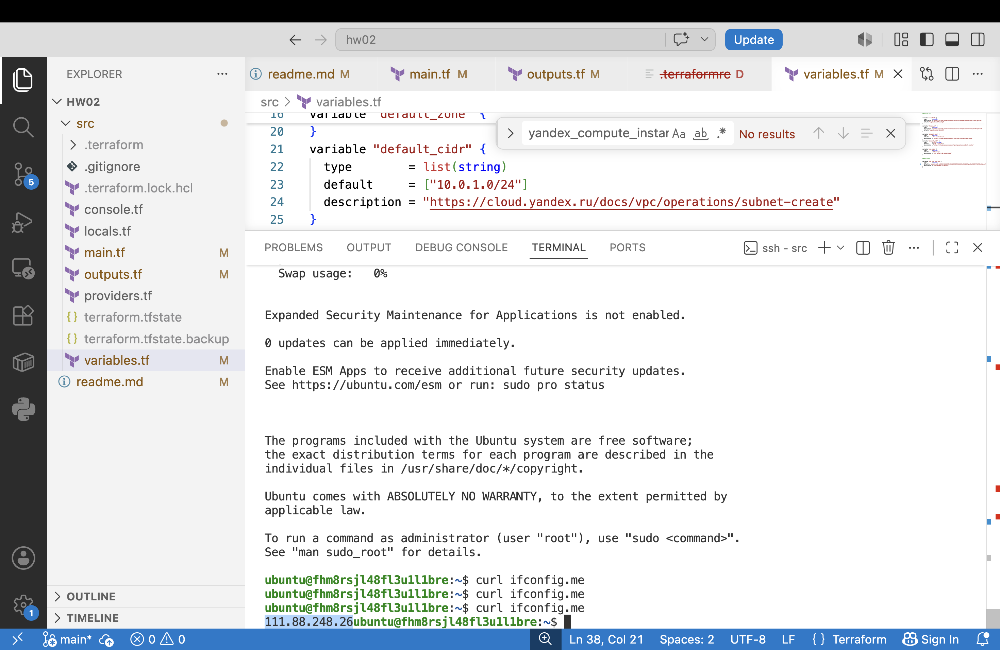
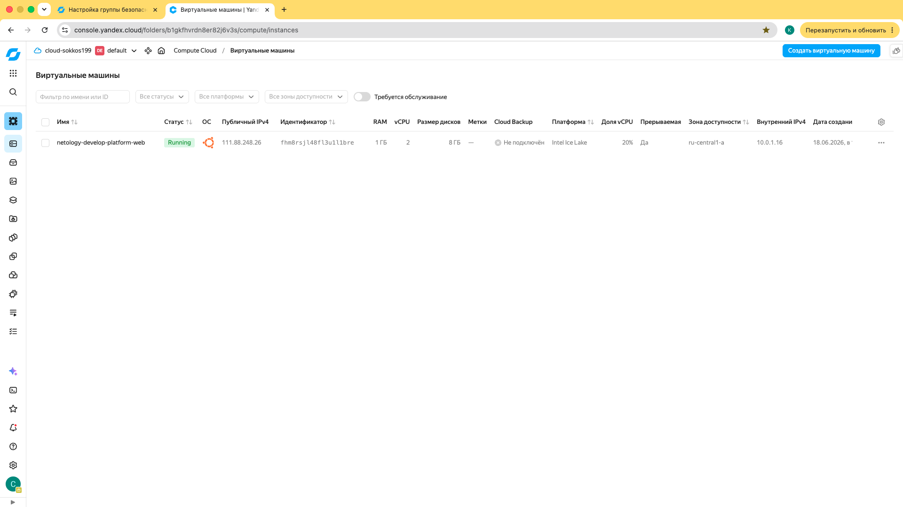
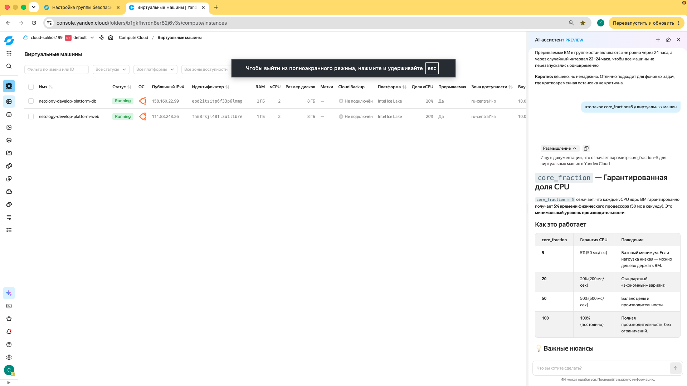
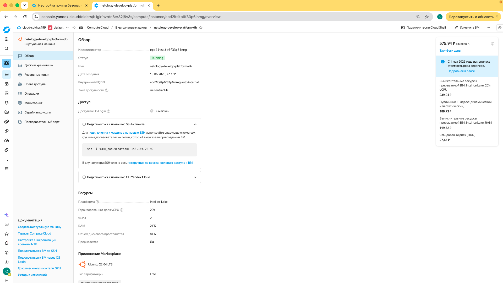

# Домашнее задание к занятию «Основы Terraform. Yandex Cloud»

### Цели задания

1. Создать свои ресурсы в облаке Yandex Cloud с помощью Terraform.
2. Освоить работу с переменными Terraform.


### Чек-лист готовности к домашнему заданию

1. Зарегистрирован аккаунт в Yandex Cloud. Использован промокод на грант.
2. Установлен инструмент Yandex CLI.
3. Исходный код для выполнения задания расположен в директории [**02/src**](https://github.com/netology-code/ter-homeworks/tree/main/02/src).


### Задание 0

1. Ознакомьтесь с [документацией к security-groups в Yandex Cloud](https://cloud.yandex.ru/docs/vpc/concepts/security-groups?from=int-console-help-center-or-nav). 
Этот функционал понадобится к следующей лекции.

------
### Внимание!! Обязательно предоставляем на проверку получившийся код в виде ссылки на ваш github-репозиторий!
------

### Задание 1
В качестве ответа всегда полностью прикладывайте ваш terraform-код в git.
Убедитесь что ваша версия **Terraform** ~>1.12.0

1. Изучите проект. В файле variables.tf объявлены переменные для Yandex provider.
2. Создайте сервисный аккаунт и ключ. [service_account_key_file](https://terraform-provider.yandexcloud.net).
4. Сгенерируйте новый или используйте свой текущий ssh-ключ. Запишите его открытую(public) часть в переменную **vms_ssh_public_root_key**.
5. Инициализируйте проект, выполните код. Исправьте намеренно допущенные синтаксические ошибки. Ищите внимательно, посимвольно. Ответьте, в чём заключается их суть.
6. Подключитесь к консоли ВМ через ssh и выполните команду ``` curl ifconfig.me```.
Примечание: К OS ubuntu "out of a box, те из коробки" необходимо подключаться под пользователем ubuntu: ```"ssh ubuntu@vm_ip_address"```. Предварительно убедитесь, что ваш ключ добавлен в ssh-агент: ```eval $(ssh-agent) && ssh-add``` Вы познакомитесь с тем как при создании ВМ создать своего пользователя в блоке metadata в следующей лекции.;
8. Ответьте, как в процессе обучения могут пригодиться параметры ```preemptible = true``` и ```core_fraction=5``` в параметрах ВМ.

В качестве решения приложите:

- скриншот ЛК Yandex Cloud с созданной ВМ, где видно внешний ip-адрес;
- скриншот консоли, curl должен отобразить тот же внешний ip-адрес;
- ответы на вопросы.

[Решение](https://github.com/sokkos1995/terraform-hw-02/commit/8da8929e0cb45003afcd8259fccb4d9511205ba4)

Была проблеа с инициализацией терраформа -  подчистил служебные файлы и заново сделал terraform init, проблема ушла
```
│ Error: Required plugins are not installed
│ 
│ The installed provider plugins are not consistent with the packages selected in the dependency
│ lock file:
│   - registry.terraform.io/yandex-cloud/yandex: the cached package for registry.terraform.io/yandex-cloud/yandex 0.206.0 (in .terraform/providers) does not match any of the checksums recorded in the dependency lock file
│ 
│ Terraform uses external plugins to integrate with a variety of different infrastructure
│ services. To download the plugins required for this configuration, run:
│   terraform init
```

Дальше была проблема с платформой
```
Error: Error while requesting API to create instance: client-request-id = 92c6eaec-c2c1-4063-8878-9339c510cdcd client-trace-id = c2c6acba-2122-4b7f-8b55-7f9287a11fe1 rpc error: code = FailedPrecondition desc = Platform "standart-v4" not found
```
Спустя пару миллионов нервных клеток обнаружил очепятку `standard`, остальное проще (коры, кор фракшн, чуть дополнить переменную с ssh ключом)





Ответы на вопросы
- `Ответьте, в чём заключается их суть`
  - `family = "ubuntu-2204-lts"` - не уверен что тут была ошибка, но терраформ ругался что не может найти нужную platform_id , адаптировал под код из лекции
  - `platform_id = "standard-v3"` - опечатка + версия
  - `cores         = 2`, `core_fraction = 20` - выбирал из предложенных терраформом значений
- `как в процессе обучения могут пригодиться параметры`
  - `preemptible = true` - ВМ создается как прерываемая, с максимальным сроком жизни в 24 часа, позволяет сэкономить деньги
  - `core_fraction=5` - каждое ядро ВМ гарантировано получает 5% времени физического процессора , это минимальный уровень производительности (можно дешево держать ВМ)

### Задание 2

1. Замените все хардкод-**значения** для ресурсов **yandex_compute_image** и **yandex_compute_instance** на **отдельные** переменные. К названиям переменных ВМ добавьте в начало префикс **vm_web_** .  Пример: **vm_web_name**.
2. Объявите нужные переменные в файле variables.tf, обязательно указывайте тип переменной. Заполните их **default** прежними значениями из main.tf. 
3. Проверьте terraform plan. Изменений быть не должно. 

[Решение](https://github.com/sokkos1995/terraform-hw-02/commit/64168d8ea785166be0797ed984b2590c91057c3c)

```bash
terraform plan
data.yandex_compute_image.ubuntu: Reading...
yandex_vpc_network.develop: Refreshing state... [id=enpu4r1plrkhbkldfiaj]
data.yandex_compute_image.ubuntu: Read complete after 0s [id=fd806c8slu9j1pa87msc]
yandex_vpc_subnet.develop: Refreshing state... [id=e9b3t6g80hu17al2351f]
yandex_compute_instance.platform: Refreshing state... [id=fhm8rsjl48fl3u1l1bre]

No changes. Your infrastructure matches the configuration.

Terraform has compared your real infrastructure against your configuration and found no differences, so no changes are needed.
```

### Задание 3

1. Создайте в корне проекта файл 'vms_platform.tf' . Перенесите в него все переменные первой ВМ.
2. Скопируйте блок ресурса и создайте с его помощью вторую ВМ в файле main.tf: **"netology-develop-platform-db"** ,  ```cores  = 2, memory = 2, core_fraction = 20```. Объявите её переменные с префиксом **vm_db_** в том же файле ('vms_platform.tf').  ВМ должна работать в зоне "ru-central1-b"
3. Примените изменения.

[Решение](https://github.com/sokkos1995/terraform-hw-02/commit/d4865057e6c7d149f5443c365ecaeb0bd21577e1)



Зону видно здесь



### Задание 4

1. Объявите в файле outputs.tf **один** output , содержащий: instance_name, external_ip, fqdn для каждой из ВМ в удобном лично для вас формате.(без хардкода!!!)
2. Примените изменения.

В качестве решения приложите вывод значений ip-адресов команды ```terraform output```.

[Решение](https://github.com/sokkos1995/terraform-hw-02/commit/bda0c0c748618a786a3d44fd92b2784831355963): [дока](https://yandex.cloud/ru/docs/terraform/resources/compute_instance#arguments-and-attributes-reference) , [код](./src/outputs.tf)

```
test = [
  {
    "dev1" = [
      "instance_name netology-develop-platform-web",
      "external_ip 62.84.124.203",
      "fqdn fhmariea1vcmpu2c5igg.auto.internal",
    ]
  },
  {
    "dev2" = [
      "instance_name netology-develop-platform-db",
      "external_ip 89.169.184.200",
      "fqdn epdhjbvfvh7haebs2l0l.auto.internal",
    ]
  },
]
```


### Задание 5

1. В файле locals.tf опишите в **одном** local-блоке имя каждой ВМ, используйте интерполяцию ${..} с НЕСКОЛЬКИМИ переменными по примеру из лекции.
2. Замените переменные внутри ресурса ВМ на созданные вами local-переменные.
3. Примените изменения.

[Решение](https://github.com/sokkos1995/terraform-hw-02/commit/3f2a1bb2e6c0eb0f2e78e4e006aad04dc5a39ee4) - [применил](./src/locals.tf), план не поменялся
```
terraform plan
data.yandex_compute_image.ubuntu: Reading...
yandex_vpc_network.develop: Refreshing state... [id=enplanme6pnc2lc64v0c]
data.yandex_compute_image.ubuntu: Read complete after 0s [id=fd806c8slu9j1pa87msc]
yandex_vpc_subnet.develop: Refreshing state... [id=e9b50q6241g3tcklu8i0]
yandex_vpc_subnet.develop-b: Refreshing state... [id=e2leqlvqd22jp268h9cm]
yandex_compute_instance.db: Refreshing state... [id=epdhjbvfvh7haebs2l0l]
yandex_compute_instance.platform: Refreshing state... [id=fhmariea1vcmpu2c5igg]

No changes. Your infrastructure matches the configuration.

Terraform has compared your real infrastructure against your configuration and found no differences, so no changes are needed.
```

### Задание 6

1. Вместо использования трёх переменных  ".._cores",".._memory",".._core_fraction" в блоке  resources {...}, объедините их в единую map-переменную **vms_resources** и  внутри неё конфиги обеих ВМ в виде вложенного map(object).  
   ```
   пример из terraform.tfvars:
   vms_resources = {
     web={
       cores=2
       memory=2
       core_fraction=5
       hdd_size=10
       hdd_type="network-hdd"
       ...
     },
     db= {
       cores=2
       memory=4
       core_fraction=20
       hdd_size=10
       hdd_type="network-ssd"
       ...
     }
   }
   ```
3. Создайте и используйте отдельную map(object) переменную для блока metadata, она должна быть общая для всех ваших ВМ.
   ```
   пример из terraform.tfvars:
   metadata = {
     serial-port-enable = 1
     ssh-keys           = "ubuntu:ssh-ed25519 AAAAC..."
   }
   ```  
  
5. Найдите и закоментируйте все, более не используемые переменные проекта.
6. Проверьте terraform plan. Изменений быть не должно.

[Решение](https://github.com/sokkos1995/terraform-hw-02/commit/7634914a45050ed19a1c2e0dc9c60fe8002fc4bf)
```
terraform plan
data.yandex_compute_image.ubuntu: Reading...
yandex_vpc_network.develop: Refreshing state... [id=enplanme6pnc2lc64v0c]
data.yandex_compute_image.ubuntu: Read complete after 0s [id=fd806c8slu9j1pa87msc]
yandex_vpc_subnet.develop-b: Refreshing state... [id=e2leqlvqd22jp268h9cm]
yandex_vpc_subnet.develop: Refreshing state... [id=e9b50q6241g3tcklu8i0]
yandex_compute_instance.platform: Refreshing state... [id=fhmariea1vcmpu2c5igg]
yandex_compute_instance.db: Refreshing state... [id=epdhjbvfvh7haebs2l0l]

No changes. Your infrastructure matches the configuration.
```

------

## Дополнительное задание (со звёздочкой*)

**Настоятельно рекомендуем выполнять все задания со звёздочкой.**   
Они помогут глубже разобраться в материале. Задания со звёздочкой дополнительные, не обязательные к выполнению и никак не повлияют на получение вами зачёта по этому домашнему заданию. 


------
### Задание 7*

Изучите содержимое файла console.tf. Откройте terraform console, выполните следующие задания: 

1. Напишите, какой командой можно отобразить **второй** элемент списка test_list.
2. Найдите длину списка test_list с помощью функции length(<имя переменной>).
3. Напишите, какой командой можно отобразить значение ключа admin из map test_map.
4. Напишите interpolation-выражение, результатом которого будет: "John is admin for production server based on OS ubuntu-20-04 with X vcpu, Y ram and Z virtual disks", используйте данные из переменных test_list, test_map, servers и функцию length() для подстановки значений.

**Примечание**: если не догадаетесь как вычленить слово "admin", погуглите: "terraform get keys of map"

В качестве решения предоставьте необходимые команды и их вывод.

------

### Задание 8*
1. Напишите и проверьте переменную test и полное описание ее type в соответствии со значением из terraform.tfvars:
```
test = [
  {
    "dev1" = [
      "ssh -o 'StrictHostKeyChecking=no' ubuntu@62.84.124.117",
      "10.0.1.7",
    ]
  },
  {
    "dev2" = [
      "ssh -o 'StrictHostKeyChecking=no' ubuntu@84.252.140.88",
      "10.0.2.29",
    ]
  },
  {
    "prod1" = [
      "ssh -o 'StrictHostKeyChecking=no' ubuntu@51.250.2.101",
      "10.0.1.30",
    ]
  },
]
```
2. Напишите выражение в terraform console, которое позволит вычленить строку "ssh -o 'StrictHostKeyChecking=no' ubuntu@62.84.124.117" из этой переменной.
------

------

### Задание 9*

Используя инструкцию https://cloud.yandex.ru/ru/docs/vpc/operations/create-nat-gateway#tf_1, настройте для ваших ВМ nat_gateway. Для проверки уберите внешний IP адрес (nat=false) у ваших ВМ и проверьте доступ в интернет с ВМ, подключившись к ней через serial console. Для подключения предварительно через ssh измените пароль пользователя: ```sudo passwd ubuntu```

### Правила приёма работыДля подключения предварительно через ssh измените пароль пользователя: sudo passwd ubuntu
В качестве результата прикрепите ссылку на MD файл с описанием выполненой работы в вашем репозитории. Так же в репозитории должен присутсвовать ваш финальный код проекта.

**Важно. Удалите все созданные ресурсы**.


### Критерии оценки

Зачёт ставится, если:

* выполнены все задания,
* ответы даны в развёрнутой форме,
* приложены соответствующие скриншоты и файлы проекта,
* в выполненных заданиях нет противоречий и нарушения логики.

На доработку работу отправят, если:

* задание выполнено частично или не выполнено вообще,
* в логике выполнения заданий есть противоречия и существенные недостатки. 

